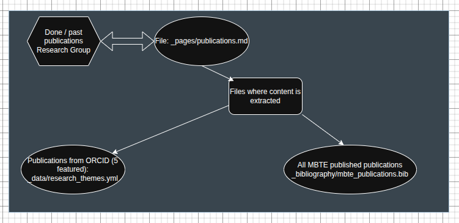
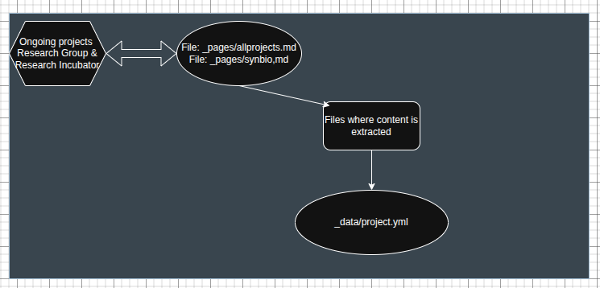

# Getting started

## Introduction

To have a clone of the website in your local PC, it is required to:

* Install Ruby. If you use a Debian/Ubuntu Distro use the following command:
```
sudo apt install ruby-full
```

1. To check that Ruby is installed, run the following command:
```
ruby -v
```
---

If installed correctly, proceed with:
* Making a clone of the repo using git clone *link_of_repo*
* Go to the folder using *cd* and run the following command in the terminal:

```
bundle config set --local path 'vendor/bundle'
```

This will basically isolate the project, and install the dependencies (or libraries) called gems inside "vendor/bundle" directory
**Note:** This is similar to what happens with Python and pip. Instead of installing global libraries, we can isolate it.

* Use the command:
```
bundle install
```

* And finally, to check that everything was sucessfull use the following command to make a local server:
```
bundle exec jekyll serve
```
If everything went well, you should see the local page in localhost

## yml files
To deploy a website in Github it is normally used something called GitHub actions.
This feature allows to run a server that does a specific task sequence, written in the .github/workflows/deploy.yml file (something this repo has)
It automatically makes changes and publish the website (usually in a branch called gh-pages) and it can be configured to run every time a change in the main branch is done or some changed are pushed into the github repo

This yml file is actually very human readable, and for this project the important changes are in the permissions (content:write), the installation of dependencies and setting up the deploy options.

### Basics

This repository contains main sections that are used through the whole project:
1. _Pages folder contains the pages we usually see, but these files take information from two sources to make them more dynamic and intuitive, the _data folder and _includes folder:
	- The _includes folder has certain pieces of code that may be used in many places, so instead of making a duplicate on every place it is needed, it is kept here to be used when desired, like the footer, the sidebar and the image gallery
	- The _data folder is when most of the magic occurs. It contains data stored like in a database that can be called from anywhere, and its useful when you need to iterate over that information. This information can be about team members with all of their characteristics (name, address, image, description, etc), or any kind
2. images folder contains every photo that's being used
3. es folder contains the same files as in _pages folder, but written in spanish
4. _bibliography has almost the same purpose as the _data folder, but it contains article references and its designed for bibliography management 

### Data content basics
#### Done pubications

The respective graphics show how the content is stored and being taken from. 


#### Ongoing projects


#### Team members
The team page takes information from the _data/team-members file, where it contains all the info about the team members 

# BMTE Research Group Official Website

This website is powered by Jekyll and some Bootstrap, Bootwatch.

Note: The initial template was taken from the [Uppsala University research group](https://github.com/uslc-lab/uslc-lab.github.io/tree/main) available on Github
Code released under the MIT License.

## Main project developed by [Bryan Wilches](https://github.com/BryanWV)
